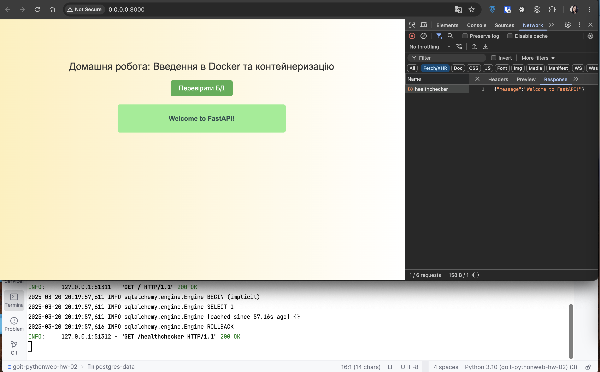

# goit-pythonweb-hw-02

## Створіть віртуальне оточення то встановіть необхідні бібліотеки

```bash
pip install -r requirements.txt
```

## Запуск:

```bash
docker-compose up
```

```bash 
python main.py
```

## Результат


